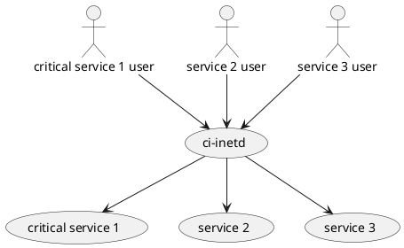
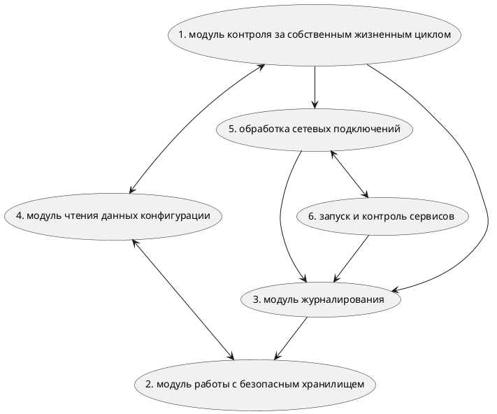
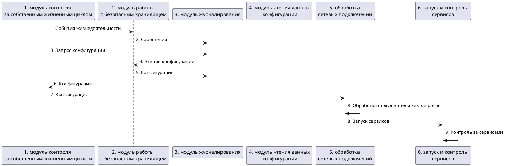

# Учебный пример "Киберимунный ci-inetd сервис"

## Постановка задачи

1. Провести первичное моделирование угроз с использованием высокоуровневой архитектуры и потоковых диаграмм.
  Ожидаемый результат: в drawio файле диаграммы последовательности для каждого домена безопасности с анализом критичности для заданных целей безопасности. Формат диаграмм - plantuml + пояснения в самой диаграмме какие цели безопасности и каким образом нарушаются  (если применимо)
2. Спроектировать и проанализировать первичную политику архитектуры для системы с учётом заданных целей безопасности
  Ожидаемый результат: диаграмма в drawio файле в нотации политики архитектуры + таблица с обоснованием уровней доверия и сводным анализом доверенной кодовой базы
3. Переработать первоначальную архитектуру, оптимизировать доверенную кодовую базу
  Ожидаемый результат: переработанная диаграмма в drawio файле в нотации политики архитектуры + таблица с  описанием каждого компонента, обновлением диаграммы последовательности (реализация функциональных сценариев), обоснованием уровней доверия и сводным анализом доверенной кодовой базы
4. Реализовать прототип на языке Python или C++ применяя MILS и FLASK (изоляция доменов и контроль взаимодействия)
    Ожидаемый результат:
    - код: публичный проект в gitflic и github репозиториях c MIT лицензией. Код должен схематично реализовывать описанные базовые сценарии работы фермы. Реализация должна содержать монитор и политики безопасности. Политики безопасности должны обеспечивать реализацию предложенной в п. 3 политики архитектуры.
    - тесты: Должны быть написаны юнит-тесты для политик безопасности. Должны быть написаны автоматические сквозные тесты.
    - документация: репозиторий должен содержать README.md файл с описанием на русском языке шагов по запуску кода проекта. В папке docs должен находиться drawio файл с результатами выполнения пп. 1-3 (взять этот файл и добавить результаты на вкладку "Решение").

### Опции

1. использование jupyter блокнота для реализации решения допускается
2. использование docker контейнеров для запуска сущностей необязательно, но приветствуется
3. использование брокера сообщений и асинхронного IPC необязательно, но приветствуется
4. создание автоматических сквозных негативных тестов необязательно, но поощряется дополнительными CPI баллами
5. идеи по доработке постановки этой учебной задачи с целью повышения интереса к её изучению и решению приветствуются

## Контекст

У владельца вычислительного комплекса для обработки пользовательских сетевых запросов требуется запускать обслуживающие программы (демоны). Обслуживающие программы бывают и большие, и маленькие. Если сразу запускать обслуживающие программы в ожидании запроса, то обслуживающие программы потребляют ресурсы вычислительного комплекса вхолостую когда запросов нет.

Владелец вычислительного комплекса, что ему нужна специальная, система которая будет ждать сетевой запрос и запускать соответствующих обработчиков запросов когда такой запрос поступит.

## Ценности и ущербы

### Активы/ценности, ущербы и неприемлемые события

| Ценность | Негативное событие | Величина ущерба | Комментарий |
|----------|----------|----------|----------|
| 1. Критичные данные | Запуск неавторизованного сервиса для обработки критичных данных. | Высокий | Например по GDPR / обработки персональных данных и т.п. |
| 2. Доступность критичного сервиса | Критичный сервис не запущен и не может обрабатывать критичные данные | Высокий | Соглашение о доступности сервиса требует конкретного уровня реакции на запросы.|
| 3. Вычислительные ресурсы | Запущенные сервисы простаивают без дела потребляя ресурсы. | Средний | Финансовые потери. |
| 4. Критичные журналы работы сервиса | Утрата или искажение критичных данных | Средний | Ухудшения анализа происходящего с сервисами |

### Цели безопасности

| Цель Безопасности | Комментарий |
|----------|----------|
| 1. При любых обстоятельствах входящие запросы для критичных сервисов обрабатываются только указанными в конфигурационном файле сервисами соответствующими этому запросу. | Защита ценности 1. |
| 2. ci-inetd делает всё от него зависящее чтобы запустить критичный сервис при пользовательском запросе. | Защита ценности 2.  |
| 3. Время простоя сервисов не превышает заданное. | Защита ценности 3.  |
| 4. При любых обстоятельствах критичные данные мониторинга сохраняют целостность и аутентичность | Защита ценности 4.  |

### Контекстная диаграмма

Иллюстрирует связи с сервисами, особенности функционирования сервисов кроме ci-inetd являются второстепенными и не рассматриваются.

Это учебный пример без претензий на реалистичность и полноту описания!

Описание сервисов

1. Critical service 1 - критичный сервис обрабатывающий критичные данные.
2. Service 2 - сервис обрабатывает некритичные данные.
3. Service 3 - сервис обрабатывает некритичные данные.

## Киберимунный ci-inetd сервис

Ключевые компоненты на функциональном уровне.

1. Модуль контроля за собственным жизненным циклом.  Модуль отвечающий за работоспособность CI-inetd.
2. Модуль работы с безопасным хранилищем. Работает с безопасным хранилищем.
3. Модуль журналирования. Отвечает за запись журналов событий и их ротацию.
4. Модуль чтения данных конфигурации. Читает данные конфигурации и проверяет, что конфигурация корректна.
5. Обработка сетевых подключений. Слушает порты для сервисов определённых в конфигурации.
6. Запуск и контроль сервисов | Запускает необходимые сервисы когда приходят запросы на них, а также поддерживает их работоспособность. |

## Базовый функциональный сценарий

Примечание: рассматривается только позитивный сценарий (ошибок нет)

